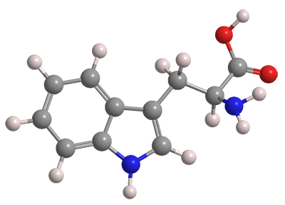

# Transformer Reaction Predictor (TRP)

## 1. Motivations
This project makes use of Transformers to predict chemical reactions. The underlying idea is similar to the one in [this paper](https://arxiv.org/pdf/1811.02633.pdf). The name of this project can be abbreviated as TRP, so you can expect I put a [tryptophan](https://en.wikipedia.org/wiki/Tryptophan) molecule as the symbol of the project.

## 2. Dataset
The dataset used in this project can be found at [this link](https://ibm.box.com/v/ReactionSeq2SeqDataset), which is the data reference by by aforementioned paper.